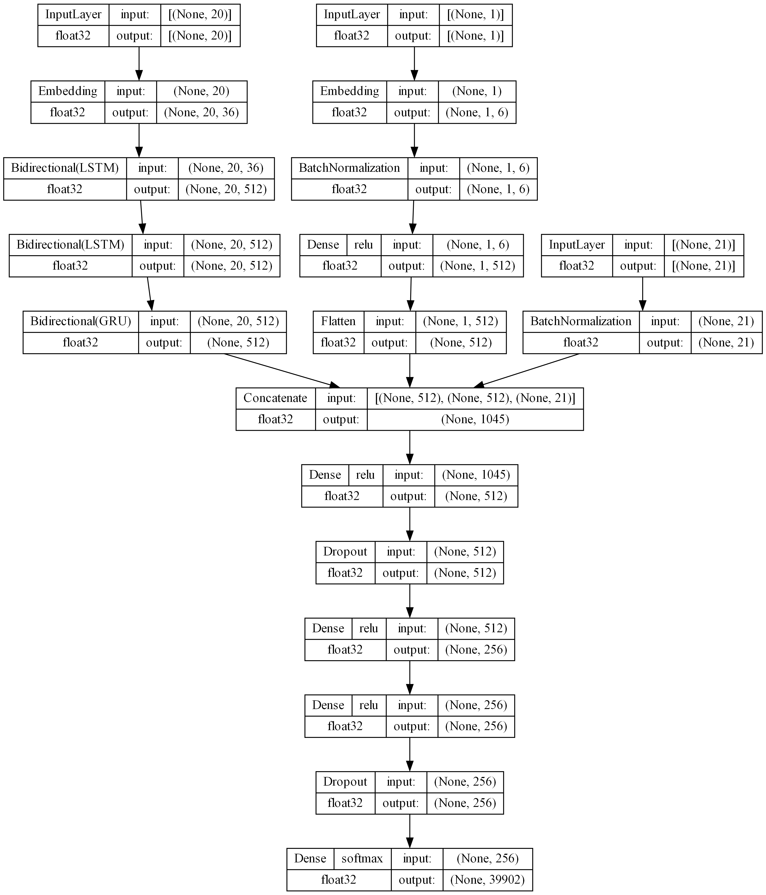

# This is my attempt at the booking destination challenge

About the challenge: https://ceur-ws.org/Vol-2855/challenge_short_1.pdf

I tried following the solution of this paper https://ceur-ws.org/Vol-2855/challenge_short_4.pdf, however my lack of understanding of certain mechanisms has pushed me to implement my own solution which is a little worse, but at least it's genuinely my work :relaxed:

###### The data
I've done the following transformations to each of the features:
 - 'user_id' :arrow_right: dropped
 - 'checkin' :arrow_right: transformed into sin and cos signal of ('day of the week', 'day of the month', 'month')
 - 'checkout' :arrow_right: transformed into sin and cos signal of ('day of the week', 'day of the month', 'month')
 - 'city_id' :arrow_right: used as both input to the RNN as padded sequence of 20 (without the predicted destination of course :laughing:) and last city of each trip is a target
 - 'device_class' :arrow_right: one-hot encoded and thrown into continuous features (just 3 classes)
 - 'affiliate_id' :arrow_right: label encoded and treated as categorical feature
 - 'booker_country' :arrow_right: one-hot encoded and thrown into continuous features (just 5 classes)
 - 'hotel_country' :arrow_right: I've decided to drop this one, since city is already the narrower category
 - 'utrip_id' :arrow_right: functions as a key of each sequence, dropped later for neural net

As input data I use:
 - sequences of last 20 cities (embedded)
 - allifiate_id (embedded)
 - stats about the next hotel booking (checkin, checkout, device etc.)

###### The architecture
The model has 3 input branches that are concatenated into a simple MLP.
The branches are as follows (from left to right):
 - RNN awaiting input sequences of cities
 - Simple Dense with Embedding that tries to make sense of 'affiliate_id' feature
 - Input of continuous features and ont-hot encoded categorical features (essentially everything besides city and affiliate goes in here)

The last layer tries to predict 4 out of 39902 cities that the booker might be interested in. 

###### The results
I've tried implementing 3 models:
 - basic - v1
 - added dropout and batch normalization (I had issues with overfitting) - v2
 - increase size of v2 - v3 (the image above)

As a main metric I used accuracy@4, which means the model is able to choose 4 cities and if one of them is correct that's a hit.

Example:

Each model was compared using 20k-fold validation, table below presents average validation acuuracy@4 and standard deviation of the results:

| Model name | Accuracy@4 | Accuracy@4 std |
|------------|------------|----------------|
| Model_v1   | 0.42312    | 0.00530        |
| Model_v2   | 0.43872    | 0.00609        |
| Model_v3   | **0.44608**    | **0.00503**        |

I's easy to see that the third architecture not only yielded the best validation accuracy but also gave the most stable results.

Now it's time to try how the models behave while faced with the test data:

| Model name | Accuracy@4 |
|------------|------------|
| Model_v1   | 0.4262     |
| Model_v2   | 0.4473     |
| Model_v3   | **0.4531**     |
